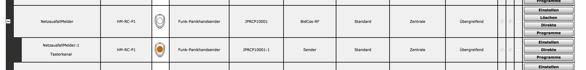

# HM-NetzausfallMelder

 

Desöfteren kommen Fragen aus dem RaspberryMatic oder auch CCU2-Bereich, wie man denn das Powerbank-gepufferte Gerät bei einem Stromausfall geordnet herunterfahren kann. 
Ich habe auf einen Arduino Pro Mini mit angeschlossenem CC1101-868MHz Funkmodul den Sketch des [1-Kanal-Senders](https://github.com/pa-pa/AskSinPP/blob/master/examples/HM-RC-P1/HM-RC-P1.ino) aus der [AskSinPP Library](https://github.com/pa-pa/AskSinPP) geflasht. 
An den Tastereingang ist ein ATTiny85 angeschlossen. 
Dieser überwacht die 5V-Eingangsspannung vom USB-Kabel. 
Ist der Strom weg, sendet der mit einer CR2032 gepufferte Arduino einen "kurzen Tastendruck" per Funk an CCU. 
Ist der Strom wieder da, wird ein "langer Tastendruck" gesendet.  
 

Man kann nun mit einem Programm bspw. bei "kurzem Tastendruck" "verzögert um xx Minuten" die Zentrale mittels Skript (Google hilft :)) herunterfahren bzw. bei rechtzeitiger Stromrückkehr, die Verzögerung bei "langem Tastendruck" abbrechen. 
Genau so gut könnte man dieses "Ding" an ein altes Handyladegerät mit USB anschließen und in eine zu überwachende Steckdose stecken. Bei Kühl-/Gefriertruhen bspw. hilfreich, um sich eine Push-Mitteilung schicken zu lassen, falls die Sicherung mal fliegt...
